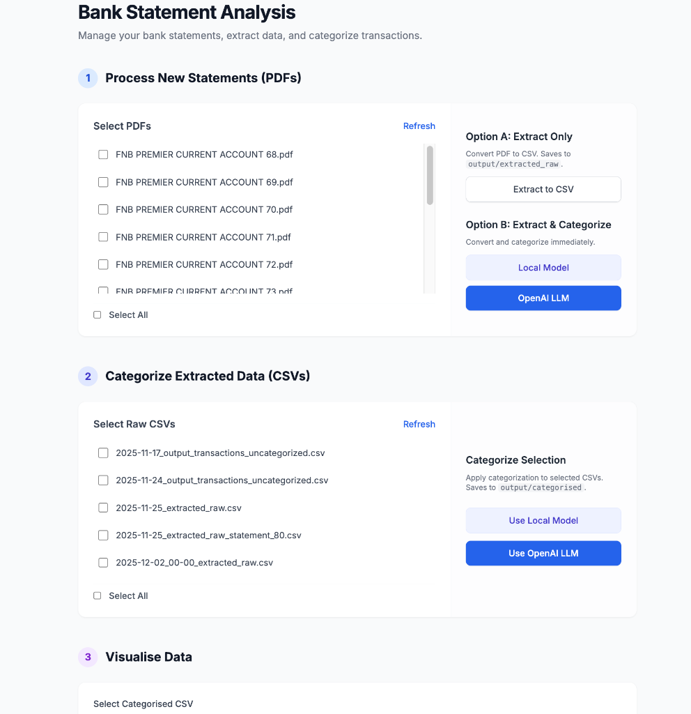

# Bank Statement Analysis

Manage your bank statements, extract data, and categorize transactions with ease. This tool supports PDF extraction and automated categorization using both OpenAI LLMs and local machine learning models.

## 🚀 Getting Started

### 1. Installation
Ensure you have `uv` installed, then run:
```bash
make install
```

### 2. Web Interface
The tool features a 3-step workflow for managing your statements:
1. **Process**: Extract data from PDF bank statements.
2. **Categorize**: Classify transactions using OpenAI or a local model.
3. **Visualise**: Review and analyze your categorized data.

To start the UI:
```bash
make start-server
```
Once started, open [http://localhost:8000](http://localhost:8000) in your browser.



## 🛠 Command Line Usage

### Quick Actions (Makefile)
- `make extract`: Batch extract PDFs to `output/`.
- `make categorize-llm`: Automated categorization via OpenAI.
- `make train`: Train the local ML model.
- `make categorize-local`: Categorization using your local model.

### Manual Execution
```bash
# Basic Extraction
PYTHONPATH=src python -m bank_statement_analysis.main --all

# Categorization (OpenAI)
PYTHONPATH=src python -m bank_statement_analysis.main --all --categorize --model gpt-4o-mini

# Local Model Training
PYTHONPATH=src python -m bank_statement_analysis.train_model

# Local Categorization
PYTHONPATH=src python -m bank_statement_analysis.main --all --categorize --categorize-mode local
```

## 📂 Project Structure
- `bank_statements/`: Place your input PDF files here.
- `output/`: Extracted CSVs and categorized data.
- `models/`: Trained local models and training data.
- `src/`: Core Python source code.
- `src/bank_statement_analysis/static/`: Web UI components.
